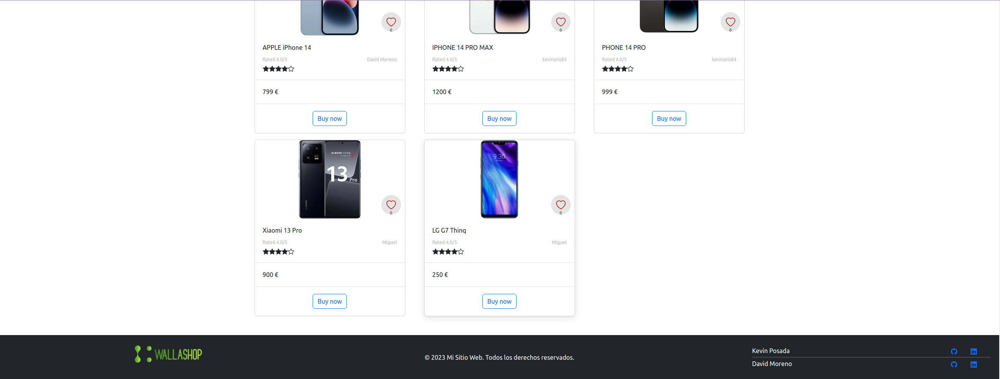
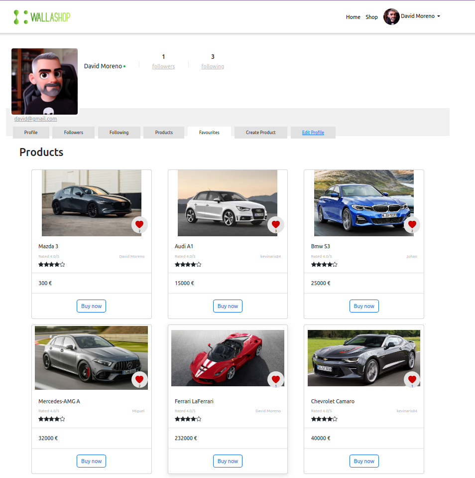
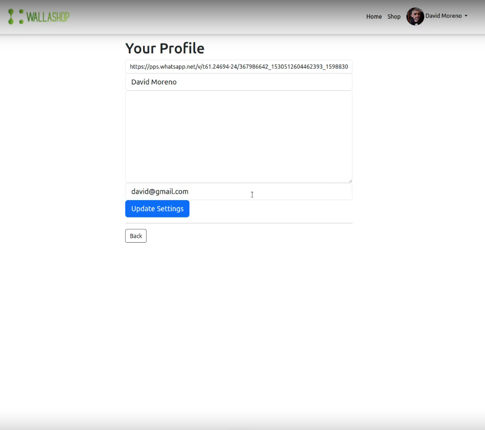
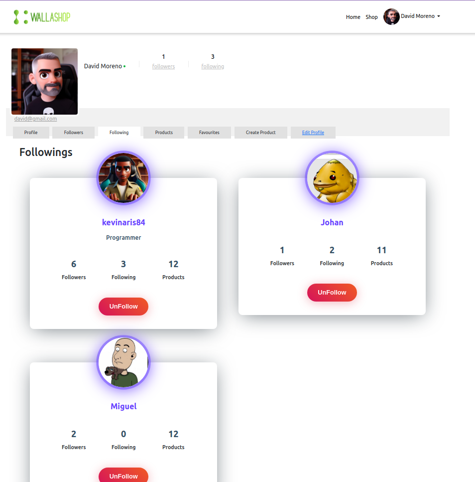
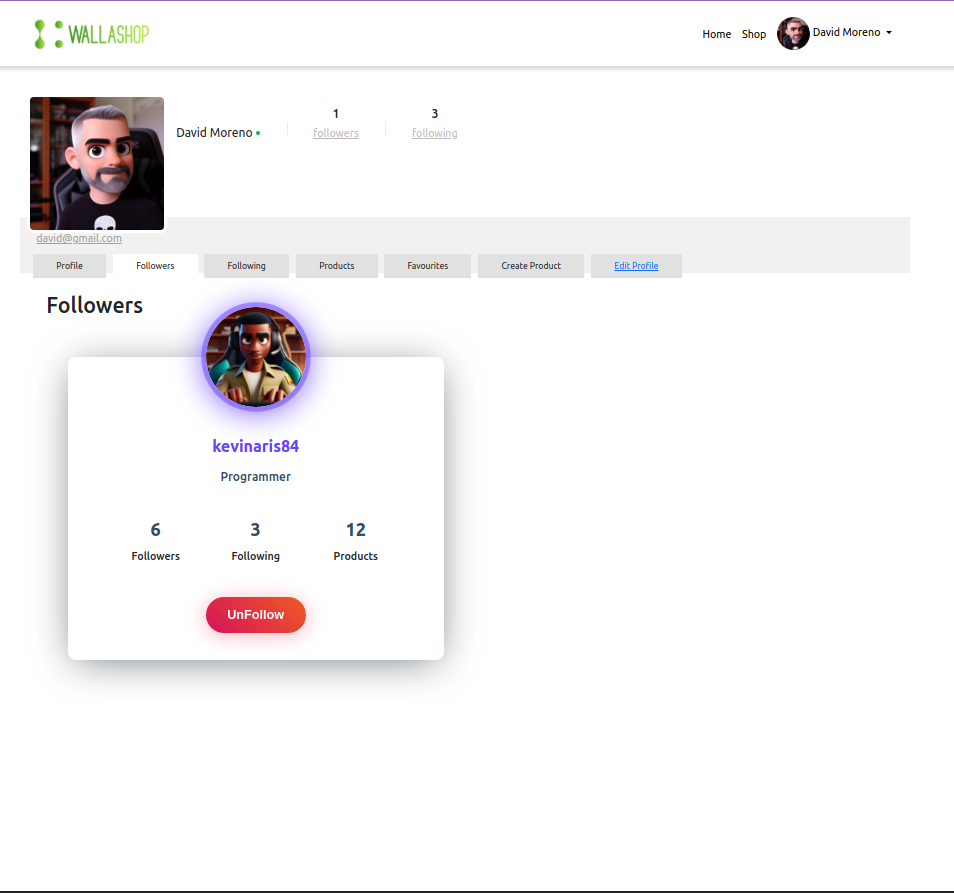
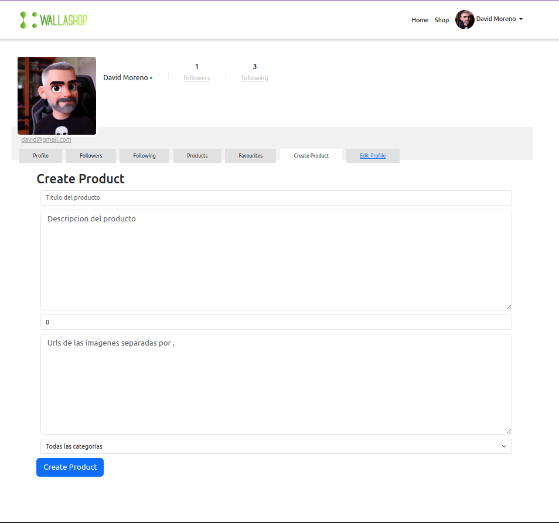
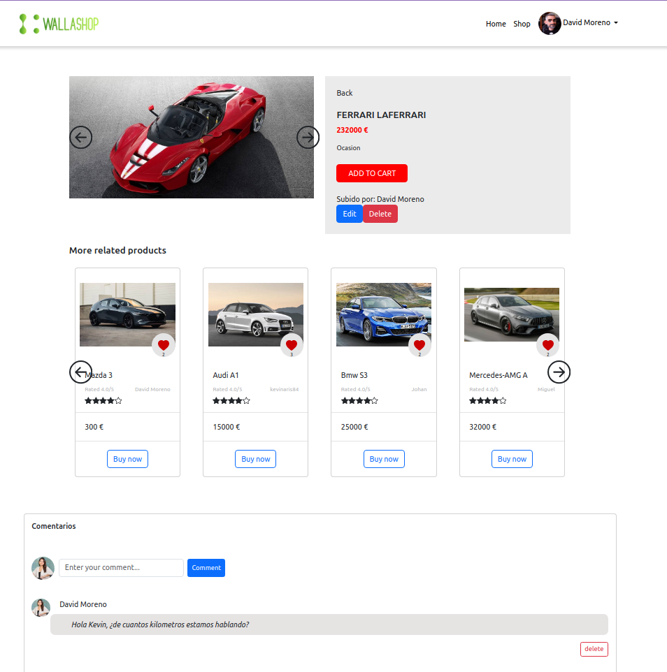
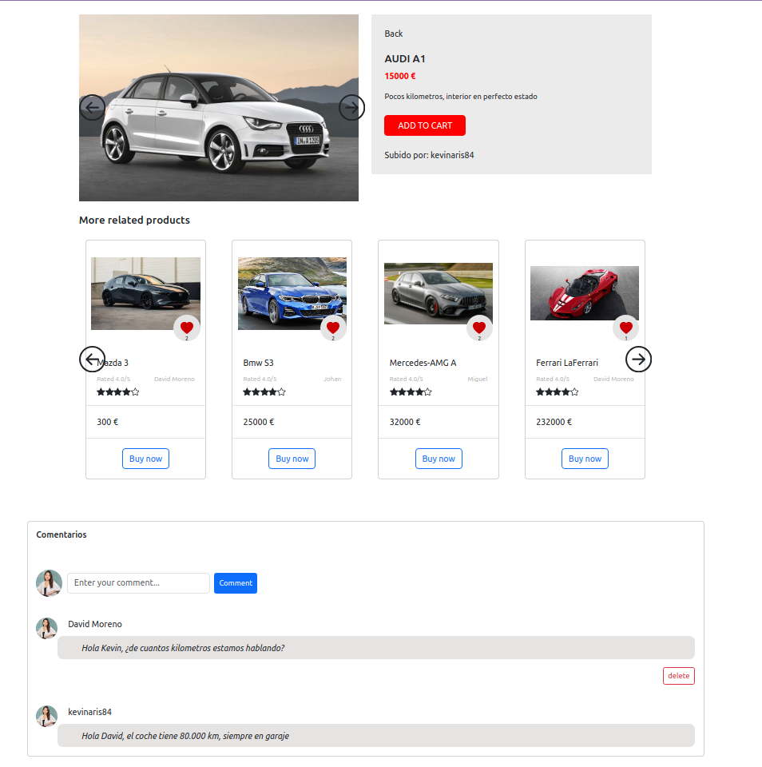
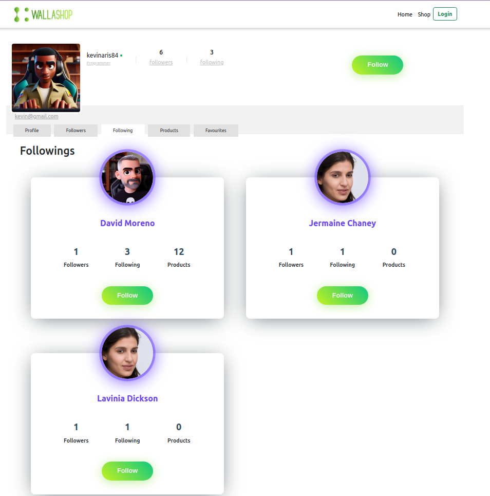

<!DOCTYPE html>
<html lang="en">

<head>
    <meta charset="UTF-8">
    <meta name="viewport" content="width=device-width, initial-scale=1.0">
    <meta name="author" content="kevposesp">
    <meta name="author" content="davidmpenades">
</head>

<body>
    <h1>Bienvenido a Wallashop</h1>
    <h2>Tú Destino Definitivo de Compras en Línea</h2>
    
Wallashop es una aplicación web de última generación que combina diversas tecnologías para crear una experiencia de compra en línea sin problemas para los usuarios. Desde el último marco de trabajo Angular hasta el sólido backend de Node.js, ¡tenemos todo cubierto!

    
Proyecto que combina:
 
    

        
        
        
    

    
Para crear una aplicación web de compras en línea.

    
Desarrollado en lenguaje de programación:

    

    
Almacenando los datos en:

    

    <h2>Funcionalidad del Proyecto</h2>
    
Vamos a ver algunas funciones y características de la aplicación:

        <pre><code>HOME</code></pre>
    
En estás primeras imagenes, podemos ver la interface de home. Donde hemos creado un menu horizontal, con el logo, la opcion de Home, shop y un boton de login.  También hemos creado un componente search.También hemos creado un componente carrusel reutilizable de categorias y debajo todos los productos dentro de cards e infinty scroll. 
    Culminando con un footer en negro con el logo, licencias y enlaces a nuestros linkedIn y Github.

      
        <pre><code>SHOP</code></pre>
    
En la página de shop, continuamos teniendo el componente search, a la izquierda tenemos los filtros. Los productos se muestan con una paginación de 6 en 6 productos.

      
            <pre><code>Register</code></pre>
      
        <pre><code>Login</code></pre>
      
    
Lo mejor de nuestra aplicación es lo que podemos hacer una vez registrados y logueados. Como observar nuestros likes:

    
    
Modificar nuestro perfil:

    
    
Ver a nuestros seguidos y seguidores:

    
    
    
Subir un producto:

    
    
Editar o eliminar un producto que hayas subido:

    
    
Hacer comentarios y poder borrarlos:

    
    
Observa otros perfiles:

    
    <h2>Instalación</h2>
    
Para ejecutar este proyecto localmente, sigue estos pasos:

    <ol>
        <li>Clona este repositorio en tu máquina local:</li>
        <pre><code>git clone https://github.com/kevposesp/wallashop_Angular16_nodeJS20_express.git</code></pre>
        <li>Instala las dependencias de Angular y Node.js:</li>
        <pre><code>cd wallashop_Angular16_nodeJS20_express</code></pre>
        <pre><code>cd server
npm install
cd ../client
npm install</code></pre>
        <li>Configura las variables de entorno necesarias.</li>
        <li>Ejecuta el servidor Node.js y la aplicación Angular:</li>
        <pre><code>cd ..
npm start</code></pre>
    </ol>
    <h2>Uso</h2>
    
Una vez que el servidor esté en funcionamiento, puedes acceder a la aplicación a través de tu navegador en
        <code>http://localhost:3000</code>.
    

    <h2>Autores</h2>
    
Este proyecto fue desarrollado por kevposesp y davidmpenades.

    <h2>Licencia</h2>
    
Este proyecto está bajo la Licencia MIT. Consulta el archivo <a href="LICENSE">LICENSE</a> para obtener más
        detalles.

</body>

</html>
