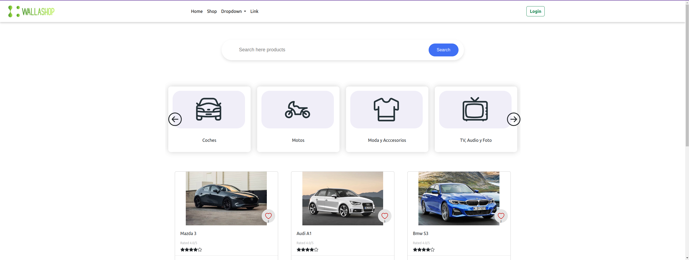
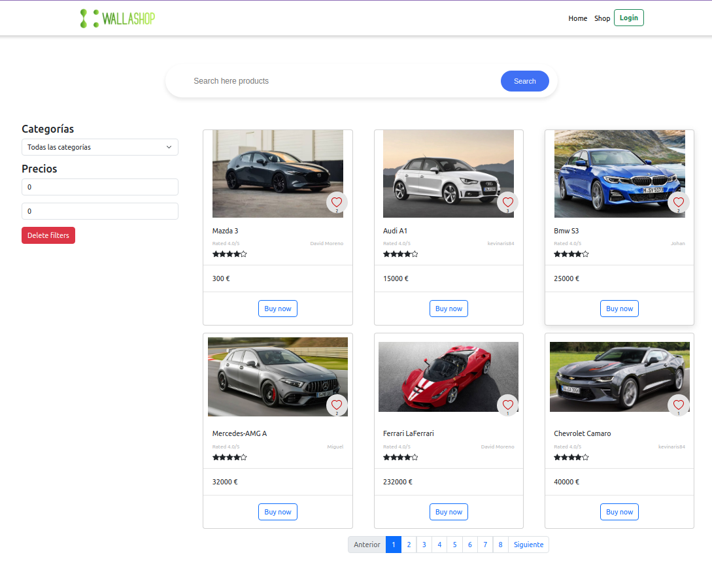

<!DOCTYPE html>
<html lang="en">

<head>
    <meta charset="UTF-8">
    <meta name="viewport" content="width=device-width, initial-scale=1.0">
    <title>Wallashop: Angular 16 + Node.js 20 + Express</title>
    <meta name="author" content="kevposesp">
    <meta name="author" content="davidmpenades">
</head>

<body>
    <h1>Wallashop</h1>
    
Proyecto que combina Angular 16, Node.js 20 y Express para crear una aplicación web de compras en línea.

    <h2>Imágenes del Proyecto</h2>
    
Aquí puedes ver algunas imágenes de la aplicación:

        <pre><code>Home</code></pre>
      
        <pre><code>Shop</code></pre>
      
        <pre><code>Login</code></pre>
      
        <pre><code>Register</code></pre>
      
    <h2>Instalación</h2>
    
Para ejecutar este proyecto localmente, sigue estos pasos:

    <ol>
        <li>Clona este repositorio en tu máquina local:</li>
        <pre><code>git clone https://github.com/kevposesp/wallashop_Angular16_nodeJS20_express.git</code></pre>
        <li>Instala las dependencias de Angular y Node.js:</li>
        <pre><code>cd wallashop_Angular16_nodeJS20_express</code></pre>
        <pre><code>cd server
npm install
cd ../client
npm install</code></pre>
        <li>Configura las variables de entorno necesarias.</li>
        <li>Ejecuta el servidor Node.js y la aplicación Angular:</li>
        <pre><code>cd ..
npm start</code></pre>
    </ol>
    <h2>Uso</h2>
    
Una vez que el servidor esté en funcionamiento, puedes acceder a la aplicación a través de tu navegador en
        <code>http://localhost:3000</code>.
    

    <h2>Autores</h2>
    
Este proyecto fue desarrollado por kevposesp y davidmpenades.

    <h2>Licencia</h2>
    
Este proyecto está bajo la Licencia MIT. Consulta el archivo <a href="LICENSE">LICENSE</a> para obtener más
        detalles.

</body>

</html>